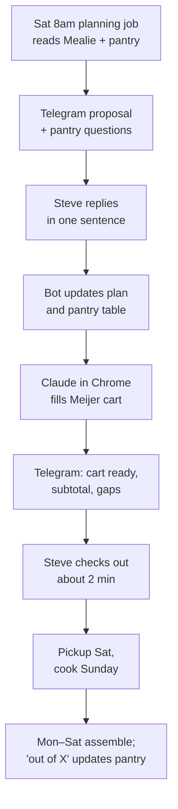
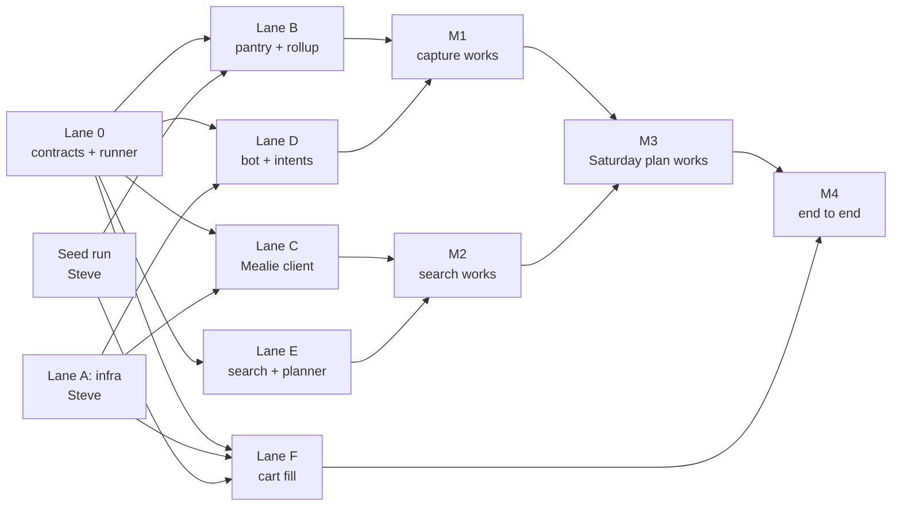

# Meal Planning Assistant

Sep 22, 2026 · @Steve

## Overview

The goal is to make "what are we eating this week" a two-minute weekend exchange. Each week has one batch-cook session and a Meijer pickup cart that fills itself. The fridge ends up full of components that turn into meals for Steve and Miles without cooking on weeknights.

This isn't a custom app. The plan connects free tools (Mealie, Tailscale, a Telegram bot, a scheduled Claude job, Claude in Chrome) with one custom piece: a small SQLite pantry table.

### Constraints

- **One cook night.** Sunday is the only planned cook, and weeknights are assembly and reheating only. The one optional exception is a simple cook-with-Miles dinner on Wednesday.
- **Custody varies.** Miles is always here Wednesday night. He's also here either Friday evening to Saturday afternoon or all day Saturday and Sunday. That's 2–3 kid dinners plus some weekend lunches, and the number changes week to week. Breakfast isn't planned: Steve makes eggs every morning, so eggs and butter just stay stocked.
- **Food rules.** Lots of veg, whole grains, minimal wheat, high protein, and dairy is fine. Miles's portions are toddler-safe: low salt, soft textures, choking hazards cut, sauce on the side.
- **Steve's weekday lunches are the real problem.** Steve is fine eating the same 1–2 lunches all week, and he can reheat at home.
- **Recipes are clean.** Existing internet recipes, shown as ingredients and steps only.
- **The cart is filled, not checked out.** Claude in Chrome can't make purchases. The end state is a filled Meijer cart, and Steve picks the pickup slot and taps checkout.
- **Free to run.** Everything runs on the home machine, not a paid server.
- **Standalone but shareable.** The project reuses the agentic OS state layer, MCP server and Telegram bot where that makes sense, but it has to work without them.

### A normal week once it's running

1. **Saturday morning:** A Telegram message offers 4–5 real recipes to pick from, plus the components that fill the gaps. It also names two lunch builds, says which kid nights are covered, and asks 1–3 yes/no pantry questions.
2. **Steve replies in one sentence:** "fajitas and meatballs, swap peppers for zucchini, out of butter."
3. **The cart fills:** Claude in Chrome combines ingredients across components, skips staples Steve already has, and adds the rest to the Meijer cart. It reports the subtotal and warns if the order is under $35.
4. **Checkout (about 2 minutes):** Steve picks a pickup slot, applies mPerks and places the order.
5. **Pickup:** Saturday afternoon or evening.
6. **Sunday cook (about 2 hours):** The picked recipes, plus veg sheet pans, a pot of rice, shredded chicken, hard-boiled eggs and 2–3 sauces, all go into containers. Miles's portions get set aside plain.
7. **Monday to Saturday:** Grab, assemble, reheat. Kid nights come from the batch or the freezer fallback. When something runs out, Steve sends one Telegram message ("out of eggs").

### Timing: propose Saturday, cook Sunday

A Sunday-morning proposal leaves too little slack. The reply, the cart, checkout, a pickup slot and the drive all have to happen before cooking, and Sunday pickup slots fill up. The proposal goes out **Saturday around 8–9 am**, with pickup Saturday afternoon. If Steve gets no reply by 4 pm Saturday, the bot sends one nudge. If there's still no reply by Sunday morning, last week's plan is treated as approved.

### Success looks like

- [ ] Under 5 minutes a week on planning and ordering
- [ ] No weeknight cooking except the optional Wednesday with Miles
- [ ] Every kid night has a plan that never needs cooking Steve doesn't want to do
- [ ] Staples never bought twice, perishables never forgotten
- [ ] Cart at $35 or more almost every week (free pickup)
- [ ] Works from the phone away from home and costs nothing beyond the existing Claude plan

## How I use it

In a normal week Steve touches the system about three times: one reply Saturday, two minutes to check out, and the odd message when something runs out.

| Where | What happens there |
| --- | --- |
| Telegram | Almost everything: the weekly plan, replies, "out of X," recipe search, ratings. Text or voice. |
| Mealie (phone or tablet) | Looking things up: the week's plan, and recipes as clean ingredients and steps. Open in the kitchen. |
| Meijer app | Paying: pickup slot and checkout. The one step Claude can't do. |
| Claude in Chrome | Fills the cart on the computer without anyone watching. Steve rarely touches it. |
| Claude chat | Optional, for bigger things like rethinking the plan or a long recipe hunt. |

### A normal week

1. **Saturday, around 8 am:** A Telegram message offers 4–5 recipes, components for the gaps, two lunch builds, kid-night coverage, and 2–3 pantry questions. Tapping a recipe opens it in Mealie.
2. **Steve replies in one line,** such as "2 and 4, Miles is here Sat–Sun, low on butter." If nothing appeals, "find me something with ground turkey that isn't tacos" gets fresh options first.
3. **About 10 minutes later:** The cart fills, and Telegram says something like "Cart ready, $58. No cotija, used feta."
4. **Two minutes:** Steve checks out in the Meijer app and replies "ordered." He picks up Saturday afternoon.
5. **Sunday, about 2 hours:** Steve works through the plan in Mealie and portions everything into containers, with Miles's set aside plain.
6. **Monday to Friday:** He grabs lunches with no decisions. Wednesday is the cook-with-Miles recipe or the freezer lane.
7. **Nights with Miles:** Dinner comes from the batch or the freezer. There's nothing new to plan.

### Anytime, from anywhere

- "Out of eggs" by text or voice puts eggs on next week's cart.
- "Add tortillas" adds a one-off item to this week.
- `/find` plus a plain-words request searches for recipes. "save 2" keeps one in Mealie.
- "No mushrooms" updates the preferences profile for every future search.
- A thumbs up or down after a kid dinner decides which recipes come back.

### Off weeks

- **No reply Saturday:** One nudge at 4 pm, then last week's plan is reused Sunday morning.
- **Away from the computer:** The list arrives as text, or Steve uses the Instacart backup.
- **A busy week:** Replying "components only" gives the least cooking, still with nothing on weeknights.

## Food system

A week can be built from full web recipes, from components, or from a mix of both. Either way, everything gets made in one Sunday session, so every meal after that is assembly, not cooking.

| Slot | Per week | Reheats well | Avoid |
| --- | --- | --- | --- |
| Proteins | 2–3 | Shredded chicken thighs, ground turkey, hard-boiled eggs | Breaded or crispy things, fish reheated twice |
| Grains | 2 | couscous, rice, ezekiel bread, siete taco shells | white bread, flour pasta,&#32; |
| Roasted veg trays | 2 | Sweet potato, broccoli, peppers + red onion, zucchini, butternut, cauliflower | Salads dressed ahead of time, anything that goes soggy |
| Sauces | 2–3 | Lemon-tahini, yogurt-garlic-lemon, salsa, herb oil, peanut-lime,&#32; | Cream sauces that split when reheated |
| Fresh | as needed | Spinach, cucumber, cherry tomatoes, avocado, berries | — |

**Rotation rule:** Swap only 1–2 components a week, usually one veg and one sauce. That keeps the cart about 80% the same every week and keeps the Sunday cook on autopilot. A component that scored well can come back after two weeks off.

### Two ways to plan a week

Components are just one option. Steve can also plan a week around full recipes from the web, or mix the two. The Saturday message defaults to a mix, and one reply switches it.

| Mode | What Steve gets | Good for |
| --- | --- | --- |
| Mix (default) | 1–2 web recipes plus components to fill the gaps | Most weeks |
| Recipes | 2–3 full web recipes, cooked Sunday | Wanting real dishes and variety |
| Components | Proteins, grains, veg and sauces to put together | Busy weeks, least effort |

### Recipe search

Steve can ask for recipes any time, in plain words, from Telegram or a Claude chat. Examples: "a slow cooker chicken recipe Miles would eat," "something with ground turkey that isn't tacos," "a sheet-pan dinner under 30 minutes." Claude searches the web, checks what it finds against the preferences profile below, and sends back 3–5 options.

Each option shows:

- The recipe name, source site and link
- Clean ingredients and steps, with no ads
- Hands-on time, servings, and whether it batches and reheats well
- A one-line note on fit, such as "uses couscous, which is wheat" or "Miles-friendly with sauce on the side"

Replying "save 2" imports option 2 into Mealie. "Add 2 to this week" also puts it on the plan and in the cart. The Saturday proposal uses the same search, so its recipe options are a mix of new finds and favorites from the rotation pool.

### Preferences profile

Every search is filtered against one short profile. It's stored as a file the search reads each time, and Steve can change it with one message, like "add: no mushrooms."

| Rule | Current setting |
| --- | --- |
| Likes | Chicken, ground turkey, eggs, rice, Siete taco shells, refried beans, roasted veg, cheese and dairy |
| Dislikes | Beans and chickpeas (refried beans are fine), quinoa |
| Grains | Rice, sweet potato, corn tortillas and Siete shells any time; couscous and Ezekiel bread sometimes; no white bread or flour pasta |
| Goals | Lots of veg, high protein, minimal wheat |
| Effort | 45 minutes hands-on or less; batches and reheats well |
| Miles | Mild flavors, soft textures, sauce on the side; favorites are nuggets, ravioli, mac and cheese |
| Sources | Prefer sites that publish structured recipe data, so Mealie imports them cleanly |

### Steve's lunch builds

Steve picks two builds a week and makes both in bulk on Sunday. Each build is a grain, a protein, a veg tray, a sauce and something fresh. These four fit the rules:

1. **Chicken sweet-potato bowl:** brown rice, shredded chicken, roasted sweet potato and broccoli, lemon-tahini, spinach.
2. **Turkey taco plate:** Siete taco shells, cumin-chili ground turkey, refried beans, roasted peppers and onion, salsa, cheese, avocado on the day.
3. **Egg and veg bowl:** rice, two hard-boiled eggs, roasted zucchini, cucumber, tomatoes, feta, yogurt-garlic sauce. Good cold.
4. **Chicken couscous bowl:** couscous, shredded chicken, roasted zucchini and peppers, yogurt-garlic sauce, feta.

Each build comes to roughly 30–40 g protein. Steve's dinners use the same components in a different combination.

### Miles's meals

- **Breakfast:** not planned. Eggs and butter stay stocked.
- **Lunch:** sliced turkey, cheese, berries and snacks, all on the standing order.
- **Dinner from the batch:** the same components, plainer. Shredded chicken, soft sweet potato cubes, rice, soft broccoli, with sauce on the side for dunking.
- **Rule:** Never plan a kid dinner for a night Steve would rather not cook. Plan one proper cook-with-Miles Wednesday (eggs and veg, corn-tortilla quesadillas, ravioli), and let the freezer cover the rest.

### Fallback lane

These stay on the standing order and get replenished when the pantry check says they're running low: **chicken nuggets, cheese ravioli with jarred red sauce, and mac and cheese.**

Mac and cheese works as a carrier, which eases the worry about how often it comes up:

- Stir in shredded chicken from the batch.
- Blend in roasted butternut or cauliflower. It disappears into the sauce.
- Swap some of the milk for Greek yogurt to add protein.
- Try one box of chickpea or lentil pasta. If Miles rejects it, drop it.

The same trick works for ravioli: stir a spoon of blended roasted veg into the red sauce.

### Toddler notes

- Salt Steve's portion after splitting, not the batch.
- Roast Miles's veg a bit longer, or steam a few florets separately.
- Quarter grapes and cherry tomatoes lengthwise, cut nuggets into strips, no whole nuts.
- Sauce always on the side.

### Wheat traps

These are easy to miss: **farro, bulgur, spelt, seitan, most whole-grain pasta, flour tortillas, panko, soy sauce (use tamari instead), many boxed mac brands.** Couscous and Ezekiel bread are wheat too. They're on the list because Steve likes them, so the planner uses them a few times a week, not every meal. Wheat-free staples are rice, sweet potato, corn tortillas and Siete shells. Miles's fallback lane is exempt, since the wheat rule is about Steve's own eating.

### Sample weekly base list

| Group | Items | Behaviour |
| --- | --- | --- |
| Proteins | Chicken family pack, 1–2 lb ground turkey | Weekly, auto-add |
| Eggs and butter | 2 dozen eggs, butter | Always stocked: eggs weekly, butter a staple |
| Grains and shells | Brown rice or pouches, couscous, Ezekiel bread, Siete taco shells | Staple, ask when due |
| Beans | Refried beans | Staple, ask when due |
| Roasting veg | Sweet potatoes, broccoli, bell peppers, red onion, zucchini | Weekly, where most rotation happens |
| Fresh | Spinach, cherry tomatoes, cucumber, avocado, berries | Weekly, auto-add |
| Dairy and sauce | Greek yogurt, shredded cheese, feta or cotija, lemons, garlic, olive oil, tahini or salsa | Yogurt, cheese and lemons weekly; oil and tahini are staples |
| Recipe extras | Whatever the picked recipes add beyond the components | Weekly, from the recipe |
| Miles | Sliced turkey, cheese slices, snacks | Weekly, auto-add |
| Fallback | Nuggets, ravioli, red sauce, mac and cheese | "Still have some?" check |

## Pantry rules

Every item gets a type, and the type decides whether the planner adds it, asks about it, or leaves it alone. The pantry table also maps each ingredient to its Meijer product, which is what keeps the cart fill reliable.

| Type | Examples | Bought | Planner behaviour |
| --- | --- | --- | --- |
| **Staple** | Olive oil, butter, rice, couscous, Siete shells, refried beans, spices, tahini | Every 2–3 months | **Asks**, never adds on its own. Asks only when the item is probably due or Steve flagged it. |
| **Perishable** | Chicken, turkey, eggs, produce, yogurt, cheese, berries | Weekly | **Adds automatically** based on the week's components. |
| **Fallback** | Nuggets, ravioli, red sauce, mac and cheese | When running low | **"Still have some?"** yes/no check. |

Status is separate from type and is either `have` or `buy_next_time`. Steve can flip any item to `buy_next_time` from his phone at any time.

### The weekly check-in

> **Recipes, pick 2–3:** turkey taco meat · sheet-pan chicken fajitas · chicken and rice enchilada bake · turkey meatballs in red sauce · egg bites. **Components to fill gaps:** shredded chicken, hard-boiled eggs · brown rice · sweet potato + broccoli, peppers + onion · lemon-tahini, salsa. **Lunches:** chicken sweet-potato bowl, turkey taco plate. **Kid nights:** Wed cook-with-Miles (ravioli), Fri + Sat from batch or freezer. Adding the usual perishables and eggs. Still good on olive oil, rice, butter? Nuggets and mac holding out?

Steve's reply might be *"fajitas and meatballs, swap peppers for zucchini, low on butter, mac fine."* The bot records the two recipe picks, drops the components they cover, swaps the veg, and flips butter to `buy_next_time`. If it can't parse something, it asks back in one line. It never asks more than three pantry questions. If more staples are due, it asks about the two most overdue and holds the rest for next week.

### On-the-go updates

Steve can text or send a voice note to the Telegram bot at any time:

- "out of eggs" flips eggs to `buy_next_time`, and the bot replies "Got it, eggs on the list."
- "add tortillas" adds a one-off item for this week only.
- "we have plenty of rice" marks rice `have` and pushes the next check back by one interval.
- "cancel the zucchini" removes it from this week's plan.

The bot always repeats back what it understood, because voice transcription is exactly where "cilantro" turns into "salami."

### Learning when staples run out

- Each staple starts with a rough guess (olive oil 10 weeks, rice 8, butter 3).
- Every purchase gets logged. After two purchases, the interval becomes the median gap between them.
- The planner asks once 90% of the interval has passed. For olive oil every 10 weeks, that's around week 9.
- "Still good" pushes the next ask back a week and lengthens the estimate a little. "Out of X" shortens it.

This is crude on purpose. A median over a few purchases is enough, and Steve can correct it in one sentence.

### Table schema

SQLite, so it can live in the agentic OS state layer or in its own file. Only `pantry_item` and `purchase_log` are needed for the first working version. `weekly_plan` comes in Phase 5 and `meal_rating` in Phase 7.

```sql
CREATE TABLE pantry_item (
    id                     INTEGER PRIMARY KEY,
    name                   TEXT NOT NULL UNIQUE,        -- canonical name, e.g. "olive oil"
    aliases                TEXT,                        -- JSON array: ["evoo"]
    category               TEXT NOT NULL CHECK (category IN ('staple','perishable','fallback')),
    status                 TEXT NOT NULL DEFAULT 'have' CHECK (status IN ('have','buy_next_time')),
    typical_interval_days  INTEGER,                     -- NULL for perishables
    last_purchased         DATE,
    default_qty            REAL,
    default_unit           TEXT,                        -- "bottle", "lb", "dozen"
    meijer_product_id      TEXT,
    meijer_url             TEXT,                        -- used by Claude in Chrome
    preferred_product_name TEXT,                        -- exact name on meijer.com
    substitute_ok          INTEGER NOT NULL DEFAULT 1,
    for_miles              INTEGER NOT NULL DEFAULT 0,
    notes                  TEXT,
    updated_at             DATETIME NOT NULL DEFAULT CURRENT_TIMESTAMP
);

CREATE TABLE purchase_log (
    id            INTEGER PRIMARY KEY,
    item_id       INTEGER NOT NULL REFERENCES pantry_item(id),
    purchased_on  DATE NOT NULL,
    qty           REAL,
    price_cents   INTEGER,
    source        TEXT DEFAULT 'meijer_pickup'
);

CREATE TABLE weekly_plan (
    id              INTEGER PRIMARY KEY,
    week_start      DATE NOT NULL UNIQUE,               -- the Sunday of the cook
    custody         TEXT,                               -- 'wed+fri_sat' or 'wed+sat_sun'
    components      TEXT NOT NULL,                      -- JSON
    status          TEXT NOT NULL DEFAULT 'proposed'
                    CHECK (status IN ('proposed','approved','cart_filled','ordered')),
    mealie_plan_ref TEXT,
    approved_at     DATETIME,
    notes           TEXT
);

CREATE TABLE meal_rating (
    id          INTEGER PRIMARY KEY,
    week_start  DATE NOT NULL,
    component   TEXT NOT NULL,
    rater       TEXT NOT NULL CHECK (rater IN ('steve','miles')),
    rating      INTEGER NOT NULL CHECK (rating IN (-1, 1)),
    rated_at    DATETIME NOT NULL DEFAULT CURRENT_TIMESTAMP
);
```

The week-one manual run supplies the seed data. That's roughly 40–50 rows, each with a category, a first-guess interval, and the Meijer product Steve actually picked.

## Architecture

The system has no custom app. It's off-the-shelf pieces plus one SQLite file, spread across the always-on home machine, Steve's phone, and the computer running his logged-in Chrome. Telegram is where the conversation happens and Mealie is where he looks things up.

| Piece | Runs on | Job |
| --- | --- | --- |
| Mealie (Docker) | Home machine | Recipe library (paste a URL, get clean ingredients and steps), the week's plan on the phone, REST API |
| Tailscale | Home machine, phone, Chrome computer | Private network so the phone reaches Mealie away from home, with no open ports |
| Pantry table (SQLite) | Home machine | Item types, have or buy status, repurchase intervals, ingredient-to-Meijer product map |
| Telegram bot (Python) | Home machine | Capture, voice notes, sending the weekly proposal, reading Steve's replies |
| Python MCP server | Home machine | Gives Claude tools for the pantry and Mealie: `get_pantry`, `set_status`, `propose_plan`, `log_purchase` |
| Weekly planning job | Home machine (see below) | Saturday 8 am: reads Mealie and the pantry, drafts the week, sends the proposal |
| Claude in Chrome | Steve's computer | After approval: combines ingredients, fills the Meijer cart, reports the subtotal. Can't check out. |

Recipe search runs on the Claude side. The weekly job and on-demand requests both use web search plus the preferences profile, and saved picks come in through Mealie's URL importer. In the bot, recipe search and the Meijer cart run as separate sessions, so recipe pages never reach the logged-in Meijer Chrome session.

### A normal week, end to end



The cart step does four things. It adds up ingredients across components (½ onion + ½ onion = 1). It drops staples marked `have`. It maps each ingredient to its Meijer product URL. Then it adds each item and notes anything out of stock. After checkout, Steve replies "ordered", and the bot logs the purchases.

### Where the weekly planning job runs

A claude.ai scheduled task runs in Anthropic's cloud. It can't reach a SQLite file on a machine in Michigan unless that machine exposes something to the internet.

- **Option A: cloud task plus an exposed MCP server.** The home machine publishes one authenticated endpoint, for example through Tailscale Funnel, and the cloud task calls it. This is a clean split, but it partly undoes the no-open-ports benefit.
- **Option B: the job runs on the home machine.** A cron entry or the agentic OS scheduler runs Claude locally at 8 am Saturday. It reads SQLite and Mealie on localhost and sends the Telegram message from the same process. Nothing is exposed.

**Recommendation: Option B.** The MCP server, bot and scheduler already live on that machine for the agentic OS, so this is one more scheduled entry. Every secret stays private. The only failure mode is the machine being down, and that already breaks Mealie anyway.

The cart fill doesn't run on a schedule. Steve's reply triggers it, and it needs his logged-in Chrome. For version 1, the bot sends the finished list and Steve starts a Claude in Chrome prompt with it. For version 2, the agentic OS starts that session automatically.

### Fit with the agentic OS

The meal planner lives in its own repo, steadows/meal-planner, and plugs into the agentic OS rather than forking it. It shares the state layer, the MCP server (one more tool group), the bot (one more handler) and the scheduler. To stay standalone, it depends on only two small functions, `get_db()` and `send_telegram()`. Both have simple defaults, so the module also runs with its own `pantry.sqlite`, bot token and cron line.

### Instacart as the backup cart path

Meijer sells through Instacart. The Instacart Developer Platform API turns an ingredient list into a shoppable page, and an MCP server for it already exists. That's more predictable than driving meijer.com in a browser. The downsides are Instacart pricing and fees, and it isn't Steve's Meijer account or mPerks. Keep it for weeks when the Meijer site changes or Steve is away from his computer.

### A lighter option

Skip Mealie. The week's plan lives in a doc, recipes are links with a cleaned-up ingredients-and-steps block, and the pantry table, bot and cart fill work the same way. Steve loses the phone recipe view and the URL importer but has one less container to run. This makes sense if, after week one, he never opens the recipe view while cooking. Mealie is easy to add later because nothing else depends on it.

## Dependencies and API requirements

Nothing here needs a paid API if Claude runs through Claude Code logged into Steve's existing plan. The one decision that matters is how Claude gets called, because Chrome control only works through a logged-in Claude Code, not an API key ([source](https://code.claude.com/docs/en/chrome)).

### Accounts and keys

| Service | What's needed | Kept in | Notes |
| --- | --- | --- | --- |
| Telegram | Bot token from BotFather, plus Steve's chat ID as the only allowed user | `.env` on the home machine | Free. Existing bot or a new one (below). |
| Mealie | Long-lived API token from `/user/profile/api-tokens` | `.env` | Every endpoint is listed at `/docs` on his own instance. |
| Claude | Claude Code signed in with `/login` on the machine that runs Chrome | Claude Code's own login | Chrome control stays off with an API key or a `claude setup-token` token. |
| Meijer | Steve's account signed in inside Chrome, and substitution preferences in mPerks | A dedicated Chrome profile | No public API, browser only. Claude pauses at a login page or CAPTCHA and asks Steve. |
| Tailscale | Free personal account | Each device | — |
| Instacart (backup only) | Developer Platform key from the Instacart developer dashboard. Development and production keys are separate. | `.env` | Not confirmed yet whether production keys need approval. |
| Transcription (optional) | Nothing for local Whisper; a key if using a hosted service | `.env` | Only for voice notes. |

### How Claude gets called

The bot needs Claude for three jobs: understanding free-text replies, recipe search, and filling the cart.

- **Recommended: Claude Code in headless mode (`claude -p`) on the home machine, signed in to Steve's plan.** It covers all three jobs, has web search and page fetching built in, and drives Chrome with `--chrome`. Usage counts toward his plan's limits rather than a separate bill.
- **Anthropic API key:** This works for parsing and search, but it's billed per use (web search too) and can't drive Chrome. It's only worth it if the bot already uses one for cheap text parsing.

The cart fill needs these on one computer: Chrome running, the Claude in Chrome extension (1.0.36 or later), Claude Code signed in, and the Meijer session. If that isn't the home machine, the bot has to start `claude --chrome -p` over there, for example through Tailscale SSH. Until then, Steve starts it by hand. Chrome control isn't supported inside WSL, so on Windows it has to run natively.

### Software on the home machine

- Docker and Docker Compose, for Mealie
- Python 3.11 or later, with the Telegram library the existing bot uses (or python-telegram-bot), `httpx` for the Mealie API, and the built-in `sqlite3`
- A scheduler, either cron or the agentic OS scheduler
- The Claude Code CLI
- Tailscale
- Optional: `faster-whisper` and `ffmpeg` for voice notes, since Telegram voice notes arrive as OGG audio
- Optional: `recipe-scrapers` for pulling recipes without going through Mealie

### Reuse the existing bot or start fresh

Only one program can read a Telegram bot token at a time. If two scripts poll the same token, Telegram rejects one with a conflict error, and a bot can't use polling and a webhook together. So reusing the bot means adding meal handlers inside its existing process, not running a second script on the same token.

| Option | Upside | Downside | Choose when |
| --- | --- | --- | --- |
| Meals module in the existing bot, same token | One chat, shared code, already works | Meal messages mixed with other agent traffic, and one crash takes both down | The bot is Python, handler-based, runs on the home machine, and the chat is quiet |
| Meals module in the same codebase, new token | Its own chat for food, restarts on its own, still shares code | One more token and process | Most cases |
| Fully separate new bot | No coupling at all | Rebuilds scaffolding that already works | The existing bot is another language, runs elsewhere, or is hard to extend |

**Recommendation: the middle option.** A dedicated food chat keeps the Saturday plan from getting buried, and a new token is one BotFather command. The code stays shared.

To confirm before building:

- [ ] What language and Telegram library does the existing bot use?
- [ ] Does it use polling or a webhook?
- [ ] Does it run on the home machine?
- [ ] Does it already call Claude, and if so through an API key or Claude Code?
- [ ] Does it already handle voice notes?

## Build plan

The build is eight phases over about 12–15 hours, spread across three or four weekends. Each phase is useful on its own. Phase 0 matters most: it gives Steve a working week and the seed data every later phase uses.

| Phase | What you get | Effort |
| --- | --- | --- |
| 0 | A working week, plus seed data | 1 hr + the cook |
| 1 | Recipes and plan on the phone at home | 1 hr |
| 2 | The same, away from home | 30 min |
| 3 | Pantry logic and product map in code | 2 hr |
| 4 | "Out of eggs" from anywhere | 2–3 hr |
| 5 | The weekly proposal arrives on its own | 2–3 hr |
| 6 | The cart fills when Steve replies | 3–4 hr |
| 7 | It gets better over time | Ongoing |

### Phase 0: manual seed run (this weekend)

- [ ] With Claude, draft this week's recipe options, components and two lunch builds from the food rules and custody pattern.
- [ ] Approve or edit them, then get the combined ingredient list with quantities added up.
- [ ] Say which staples are already in the house.
- [ ] Claude in Chrome adds each item to the Meijer cart and records the product name and URL it picked.
- [ ] Check the cart, fix wrong picks, choose a pickup slot, check out.
- [ ] Export two CSVs: components with recipe URLs, and ingredient-to-Meijer product (name, product, URL, category, first-guess interval).
- [ ] Cook Sunday. Note what reheated badly and what Miles refused.

### Phase 1: Mealie in Docker (about 1 hour)

The settings below were checked against Mealie's installation and backend-config docs on Sept 22, 2026. The docs example pinned `v3.27.0`. Check GitHub for the newest tag before deploying.

```yaml
services:
  mealie:
    image: ghcr.io/mealie-recipes/mealie:v3.27.0   # check for newest tag
    container_name: mealie
    restart: always
    ports:
      - "9925:9000"                                 # host:container
    deploy:
      resources:
        limits:
          memory: 1000M
    volumes:
      - mealie-data:/app/data/
    environment:
      ALLOW_SIGNUP: "false"
      PUID: 1000
      PGID: 1000
      TZ: America/Detroit
      BASE_URL: http://<tailscale-hostname>:9925    # set after Phase 2

volumes:
  mealie-data:
```

- [ ] Run `docker compose up -d` and open `http://localhost:9925`.
- [ ] Log in with the default `changeme@example.com` / `MyPassword`, then change it right away.
- [ ] Set `PUID`/`PGID` to your host user IDs (the default is 911) so the data volume is writable. Set `TZ`, or meal-plan dates will be off.
- [ ] Create a long-lived API token at `/user/profile/api-tokens`. Interactive API docs are at `/docs`.
- [ ] Import the Phase 0 recipes by URL and fix any the importer mangled.
- [ ] Tag recipes by slot: `protein`, `grain`, `veg-tray`, `sauce`, `kid-cook`, `lunch-build`.
- [ ] Set the machine to never sleep, and start Docker on boot.

Not yet tested: whether the importer handles every recipe site Steve uses.

### Phase 2: Tailscale (about 30 minutes)

- [ ] Install Tailscale on the home machine and run `tailscale up`.
- [ ] Install the Tailscale phone app and sign in with the same account.
- [ ] On cellular, open `http://<machine-name>:9925` and add it to the home screen.
- [ ] Turn on MagicDNS for a stable hostname, then set `BASE_URL` to match.
- [ ] If Chrome runs on a different computer, install Tailscale there too.

### Phase 3: pantry table (about 2 hours)

- [ ] Create `pantry_item` and `purchase_log` in the agentic OS SQLite file, or in a standalone `pantry.sqlite`.
- [ ] Load the Phase 0 CSV, assign categories, and set first-guess intervals.
- [ ] Add MCP tools: `list_pantry`, `set_status`, `log_purchase`, `staples_due`, `resolve_product`.
- [ ] Write the function that combines quantities across recipes, with tests for ½ + ½, "1 lb" + "8 oz", and "2 cloves" + "1 head."
- [ ] Check that the module runs with no agentic OS imports.

### Phase 4: Telegram bot, capture first (about 2–3 hours)

- [ ] Create the bot with BotFather (`/newbot`) and lock it to Steve's chat ID.
- [ ] Free text goes to Claude, which turns it into pantry operations, applies them through the MCP tools, and repeats back what changed.
- [ ] Voice notes: transcribe (Whisper locally or through an API), then send the text down the same path. Always repeat the transcript back.
- [ ] Commands: `/pantry`, `/plan`, `/due`.

* [ ] Write the preferences profile file (likes, dislikes, grains, goals, effort, Miles, sources).
* [ ] Recipe search: `/find` plus plain words returns 3–5 options filtered by the profile. "save N" imports to Mealie, and "add N to this week" puts it on the plan.

This estimate assumes the agentic OS bot scaffolding already exists. Without it, double the time.

### Phase 5: weekly planning job (about 2–3 hours)

- [ ] Add a Saturday 8 am job to the home-machine scheduler. Feed Claude the last three weeks of plans, Mealie recipes by tag, `staples_due()`, the fallback items, and this week's custody pattern.
- [ ] Output is JSON: 4–5 recipe options from Mealie or the web, proteins, grains, veg trays, sauces, two lunch builds, kid-night coverage, and up to three pantry questions. Save it as a proposed `weekly_plan` and create the Mealie meal-plan entries.
- [ ] Send the Telegram message and parse the reply into recipe picks, swaps and pantry answers.
- [ ] Nudge at 4 pm Saturday if there's no reply. Reuse last week's plan Sunday at 8 am if there's still no reply.

### Phase 6: cart fill (about 3–4 hours, mostly testing)

- [ ] On approval, build the list: combine quantities, drop staples marked `have`, attach Meijer URLs.
- [ ] Version 1: the bot sends the list and Steve starts a Claude in Chrome prompt with it. Version 2: the agentic OS starts that session automatically.
- [ ] Claude opens each product URL (or searches by name if the link is dead) and adds the item. It reports the subtotal, substitutions and anything it couldn't find.
- [ ] Replying "ordered" logs the purchases and closes out the week.
- [ ] Use a dedicated Chrome profile for Meijer, and do recipe browsing somewhere else.

### Phase 7: improvements (ongoing, 1–2 hours each)

- [ ] Thumbs up or down after kid dinners, so well-liked meals come back more often.
- [ ] Staple intervals learned from the purchase log.
- [ ] Pair components that finish a package, such as the second half of the cilantro.
- [ ] Instacart backup path as `/cart instacart`.
- [ ] Track mac and cheese variations and the chickpea-pasta trial as rated components.

## Implementation plan

The code lives in its own repo, `steadows/meal-planner`, as a `meals` package that can plug into the agentic OS later. Its modules only talk through shared contracts. Those are written first, so separate agents can build different modules at the same time without stepping on each other.

### Code layout

```text
meals/
  config.py          # env: bot token, chat ID, Mealie URL + token, paths
  db.py              # get_db(), migrations for the pantry-rules schema
  contracts.py       # pydantic models: WeekProposal, RecipeOption, Intent, CartList, CartReport
  claude_runner.py   # wraps `claude -p` / `claude --chrome -p`: timeouts, JSON output, retries
  pantry.py          # item types, status flips, staples_due(), learned intervals
  rollup.py          # quantity math and unit normalisation across recipes
  mealie_client.py   # httpx: search, import from URL, tags, meal plans, shopping list
  prefs.yaml         # preferences profile
  search.py          # /find: request + prefs -> RecipeOption list; save / add
  planner.py         # Saturday WeekProposal: history + prefs + pantry -> proposal
  cart.py            # CartList from approved plan; runs Chrome session; parses CartReport
  bot/
    handlers.py      # commands and free-text router
    intents.py       # reply text -> Intent list (via claude_runner)
    voice.py         # download OGG, transcribe, hand to intents
  jobs.py            # sat_propose, sat_nudge, sun_autoapprove, cart_fill
  mcp_tools.py       # pantry and plan tools for the agentic OS MCP server
  fakes/             # fake Claude, Mealie and Chrome for tests
tests/
```

### Shared contracts (written first)

| Contract | Shape | Used by |
| --- | --- | --- |
| Database schema | `pantry_item`, `purchase_log`, `weekly_plan`, `meal_rating` (Pantry rules section) | pantry, planner, cart, bot |
| `claude_runner.run(prompt, schema=None, chrome=False, timeout=600)` | Returns validated JSON, or raises with the raw output attached | search, planner, intents, cart |
| `RecipeOption` | name, url, source, hands\_on\_min, servings, batch\_ok, fit\_note, ingredients\[\], steps\[\] | search, planner, bot |
| `WeekProposal` | mode, recipe\_options\[\], components{}, lunch\_builds\[\], kid\_nights\[\], pantry\_questions\[\] | planner, bot, cart |
| `Intent` | kind (pick, swap, custody, pantry\_flip, add\_item, find, save, rate, mode), args | bot, pantry, planner |
| `CartList` / `CartReport` | Items with qty, unit, meijer\_url, preferred\_name / added\[\], substituted\[\], missing\[\], subtotal | cart, bot |
| `mealie_client` interface | `import_url()`, `get_recipe()`, `list_by_tag()`, `set_meal_plan()` | search, planner, cart |
| `pantry` interface | `staples_due()`, status flips | planner, bot |

Every contract ships with a fake in `meals/fakes/`, so each lane can test against the fakes before the real pieces exist. The `mealie_client` and `pantry` interfaces are `typing.Protocol` classes in `contracts.py`. `mealie_client.py` and `pantry.py` implement them, and the modules that use them take an implementation as an argument instead of importing it.

### Definition of done for every module

- [ ] Unit tests pass against the fakes
- [ ] No imports from other `meals` modules except `contracts`, `db`, `config`, `claude_runner` and `rollup` (pure math). Only the entry points (`bot/`, `jobs`, `mcp_tools`, `__main__`) import the real modules and wire them together. `import-linter` enforces this in the test run.
- [ ] Runs standalone with a local `pantry.sqlite` and `.env`
- [ ] Claude prompts live in files under `meals/prompts/<lane>/`, not inline strings

## Concurrency lanes

Once Lane 0's contracts exist, four code lanes can run in parallel, while Steve's two hands-on lanes run from day one. The cart fill is the riskiest lane, so it gets a spike in week one.



Lane G wires up the scheduled jobs, which is what turns M1 and M2 into M3. The Build plan phases above still describe each piece, and these lanes are the order to build them in when agents work in parallel.

| Lane | Who | Scope | Needs first | Done when | Effort |
| --- | --- | --- | --- | --- | --- |
| 0 Contracts | One agent | `config`, `db`, `contracts`, `claude_runner`, fakes | Nothing | Fakes pass; a real `claude -p` call returns valid JSON | 2–3 hr |
| A Infra | Steve, by hand | Mealie Docker, Tailscale, new bot token, Chrome profile with Meijer login and extension, Claude Code `/login` | Nothing | Phone opens Mealie on cellular; `claude --chrome -p` can open meijer.com | 2 hr |
| Seed run | Steve with Claude | Manual first week, two seed CSVs | Nothing | Order placed, CSVs saved | 1 hr + cook |
| B Pantry | Agent | `pantry`, `rollup`, seed loader, `mcp_tools` | Lane 0; seed CSV (a fixture is fine to start) | Unit math tests pass; `staples_due()` right on seed data | 3 hr |
| C Mealie | Agent | `mealie_client`, tag conventions | Lane 0; Lane A's Mealie for integration tests | Imports a real URL and writes a meal plan | 2 hr |
| D Bot | Agent, once the existing-bot questions are answered | `bot/`, voice | Lane 0; bot token; answers about the current bot | "Out of eggs" by text and voice updates the pantry | 3–4 hr |
| E Search and planner | Agent | `search`, `planner`, `prefs.yaml`, prompts | Lane 0; Mealie fake | `/find` returns 3–5 valid options; planner produces a valid proposal from fixtures | 4 hr |
| F Cart | Steve with an agent (needs his Chrome) | `cart`, Chrome prompt, report parsing | Lane 0; Lane A Chrome; seed product map | A 10-item list lands in the real Meijer cart with an accurate report | 4 hr, mostly testing |
| G Wiring | One agent, last | `jobs`, schedule, end-to-end test | M1 and M2 | A full Saturday dry run works | 2 hr |

### Suggested order

1. **This weekend:** Steve does Lane A and the seed run. One agent builds Lane 0.
2. **Early week one:** Run a cart spike, asking `claude --chrome -p` to add five items to the Meijer cart. If Meijer's site fights it, switch Lane F to the Instacart path before building more.
3. **Week one:** Lanes B, C and E run in parallel, each in its own git worktree. Lane D starts once the bot questions are answered.
4. **Week two:** Hit M1 and M2, then Lane G wires the jobs. Do a real Saturday dry run for M4.

### Rules so parallel agents don't collide

- Each lane owns its files and works on its own branch or worktree.
- Only Lane 0 edits `contracts.py`, `db.py`, `config.py`, `claude_runner.py` and `meals/fakes/`. Other lanes request changes as small PRs and never edit them directly.
- Any lane may add to `pyproject.toml` and `tests/conftest.py`, but only by adding. Changing or removing what's there goes through Lane 0.
- Lanes test against `meals/fakes/`. Real services are only used in integration tests.
- Merge order follows the diagram: 0, then B, C, D and E in any order, then F and G in either order. G doesn't wait for F; if F lands second, G wires the cart-fill job in a small follow-up.

### Coordination with agent-brain

The repo runs the agent-brain vault (`.brain/`), which tracks each lane, the branch it owns, and what it's waiting on.

| Lane | Branch | Waits on |
| --- | --- | --- |
| contracts | `feat/contracts` | — |
| pantry | `feat/pantry` | contracts |
| mealie | `feat/mealie` | contracts |
| search | `feat/search` | contracts |
| bot | `feat/bot` | contracts, plus answers about the existing bot |
| cart | `feat/cart` | contracts, pantry |
| wiring | `feat/wiring` | pantry, mealie, search, bot |

Every lane branches from main after contracts merges. Each "waits on" is a waiting-on note in `.brain/connections/`. The brain resolves it automatically when the blocking lane sets its presence status to `done`. A shared-rule note records that only the contracts lane edits `meals/contracts.py`. Setup and the seed run are Steve's hands-on lanes, so they have no branches.

### Runtime concurrency

The running system is small, but a few things can overlap, like a voice note arriving mid-cart-fill or a job re-running after a reboot.

- **Plan status is the lock.** Each job checks `weekly_plan.status` before acting. It only proposes if no plan exists, auto-approves only while status is `proposed`, and fills the cart only once status is `approved`. That makes every job safe to rerun.
- **One Chrome session at a time.** Cart fills go through a single queue with a lock file. A second request waits, and the bot says so.
- **The bot never blocks.** Search, planning and cart runs happen in background subprocesses. The bot replies "on it" right away and posts the result when it's done.
- **Late pantry changes go to next week.** "Out of eggs" after the cart list is built goes onto next week's order, and the bot says so, unless Steve replies "add now."
- **SQLite in WAL mode** with short transactions. A single writer is plenty at this scale.
- **At most two Claude processes at once,** to stay inside the plan's usage limits.

## Risks, edge cases and costs

The system costs nothing beyond groceries and the existing Claude plan. The biggest risk isn't the tech. It's the Sunday cook not happening.

| Risk | What goes wrong | Mitigation |
| --- | --- | --- |
| Claude in Chrome can't pay | Checkout is always manual | Built into the design. Steve's 2 minutes are the pickup slot, mPerks and placing the order. |
| Meijer site changes | Cart fill breaks or adds wrong items | The product map stores both the URL and the product name, so search works as a fallback. Claude reports every item it adds, and Steve reviews the cart before checkout. Instacart is the backup. |
| Recipe importer fails on a site | Import comes back as garbage | Test Steve's real sources in Phase 1. When a site fails, paste the recipe text and have Claude clean it up. |
| Out of stock | A component is missing on Sunday | Set substitution preferences in the mPerks profile. Set `substitute_ok` per item. The cart report lists anything it couldn't find. |
| Custody week guessed wrong | Wrong number of kid dinners | Custody is an input, not an assumption. The message names the kid nights, so fixing a wrong guess takes one word. |
| Quantity mistakes | Too much or too little | Unit-aware totals with tests, rounded up to buyable units. Perishables are added automatically, so the chicken never gets forgotten. |
| Order under $35 | $4.95 pickup fee | The cart report flags it and suggests a staple that's nearly due. |
| Home machine down | No proposal, no Mealie, no bot | Never sleep, Docker `restart: always`, services start on boot, a heartbeat alert. Fallback is the manual Phase 0 loop. |
| Hidden instructions on recipe sites | A web page tries to steer the agent in the logged-in Meijer session | Use separate Chrome profiles. The cart session only opens meijer.com URLs from the product map, and recipes come in through Mealie's server-side importer. |
| Voice mistranscription | The wrong item gets flipped | The bot always repeats back what it heard and asks about unknown items. |
| Getting bored | Steve stops using it | Rotation rule, ratings, and a monthly "try one new sauce" nudge. |
| A hosted planner shuts down | The tool disappears | Mealime, a popular hosted planner, shuts down Oct 21, 2026. Self-hosting means the only thing that can disappear is a pinned Docker image. |

### Edge cases

- **Away from the computer all weekend:** Use Instacart, or have the bot send the list as plain text so Steve can fill the cart from his phone.
- **New ingredient with no product mapping:** Claude searches meijer.com, adds its best guess and flags it. Whatever Steve keeps gets saved to the map.
- **Nothing rotated for three weeks:** That's fine. The point is making the boring week effortless.
- **Backups:** Back up the `mealie-data` volume and the SQLite file nightly, wherever the agentic OS already backs up.

### Costs

| Item | Cost |
| --- | --- |
| Mealie, Docker, Tailscale (personal), Telegram bot | $0 |
| Claude in Chrome and local Claude runs | Included in the existing paid plan |
| Meijer pickup | $0 at $35 or more, $4.95 under |
| Instacart Developer Platform API (backup) | $0 for the API; Instacart pricing and fees if Steve orders through it |
| Voice transcription | $0 with local Whisper, or pennies through an API |

### What would actually make this fail

Everything downstream assumes the components are in the fridge. The number to watch is "did the Sunday cook happen." If it didn't happen two weeks in a row, shrink the plan: fewer components, more freezer lane. A four-component Sunday that happens beats an eight-component one that doesn't.

## Sources

- [Mealie on GitHub](https://github.com/mealie-recipes/mealie)
- [Mealie SQLite install docs](https://docs.mealie.io/documentation/getting-started/installation/sqlite/)
- [Claude in Chrome permissions guide](https://support.claude.com/en/articles/12902446-claude-in-chrome-permissions-guide)
- [Meijer: Shop Your Way (pickup fees)](https://www.meijer.com/shopping/services/more-ways-to-meijer.html)
- [Instacart Developer Platform](https://docs.instacart.com/developer_platform_api)
- [Mealime shutdown notice](https://www.mealime.com/)
